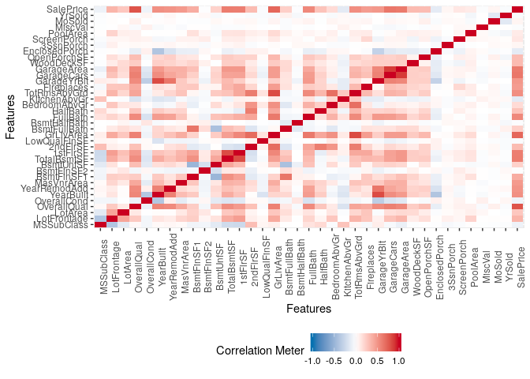

## Dataset

Import the dataset first.

```r
library(readr)
dataset <- read_csv("dataset.csv")
```

```
## Parsed with column specification:
## cols(
##   .default = col_character(),
##   Id = col_integer(),
##   MSSubClass = col_integer(),
##   LotFrontage = col_integer(),
##   LotArea = col_integer(),
##   OverallQual = col_integer(),
##   OverallCond = col_integer(),
##   YearBuilt = col_integer(),
##   YearRemodAdd = col_integer(),
##   MasVnrArea = col_integer(),
##   BsmtFinSF1 = col_integer(),
##   BsmtFinSF2 = col_integer(),
##   BsmtUnfSF = col_integer(),
##   TotalBsmtSF = col_integer(),
##   `1stFlrSF` = col_integer(),
##   `2ndFlrSF` = col_integer(),
##   LowQualFinSF = col_integer(),
##   GrLivArea = col_integer(),
##   BsmtFullBath = col_integer(),
##   BsmtHalfBath = col_integer(),
##   FullBath = col_integer()
##   # ... with 18 more columns
## )
```

```
## See spec(...) for full column specifications.
```

The dataset has 81 varibles (columns) and 1460 observations (rows). 

Let's give a first look:


```r
head(dataset)
```

```
## # A tibble: 6 x 81
##      Id MSSubClass MSZoning LotFrontage LotArea Street Alley LotShape
##   <int>      <int> <chr>          <int>   <int> <chr>  <chr> <chr>   
## 1     1         60 RL                65    8450 Pave   <NA>  Reg     
## 2     2         20 RL                80    9600 Pave   <NA>  Reg     
## 3     3         60 RL                68   11250 Pave   <NA>  IR1     
## 4     4         70 RL                60    9550 Pave   <NA>  IR1     
## 5     5         60 RL                84   14260 Pave   <NA>  IR1     
## 6     6         50 RL                85   14115 Pave   <NA>  IR1     
## # … with 73 more variables: LandContour <chr>, Utilities <chr>,
## #   LotConfig <chr>, LandSlope <chr>, Neighborhood <chr>,
## #   Condition1 <chr>, Condition2 <chr>, BldgType <chr>, HouseStyle <chr>,
## #   OverallQual <int>, OverallCond <int>, YearBuilt <int>,
## #   YearRemodAdd <int>, RoofStyle <chr>, RoofMatl <chr>,
## #   Exterior1st <chr>, Exterior2nd <chr>, MasVnrType <chr>,
## #   MasVnrArea <int>, ExterQual <chr>, ExterCond <chr>, Foundation <chr>,
## #   BsmtQual <chr>, BsmtCond <chr>, BsmtExposure <chr>,
## #   BsmtFinType1 <chr>, BsmtFinSF1 <int>, BsmtFinType2 <chr>,
## #   BsmtFinSF2 <int>, BsmtUnfSF <int>, TotalBsmtSF <int>, Heating <chr>,
## #   HeatingQC <chr>, CentralAir <chr>, Electrical <chr>, `1stFlrSF` <int>,
## #   `2ndFlrSF` <int>, LowQualFinSF <int>, GrLivArea <int>,
## #   BsmtFullBath <int>, BsmtHalfBath <int>, FullBath <int>,
## #   HalfBath <int>, BedroomAbvGr <int>, KitchenAbvGr <int>,
## #   KitchenQual <chr>, TotRmsAbvGrd <int>, Functional <chr>,
## #   Fireplaces <int>, FireplaceQu <chr>, GarageType <chr>,
## #   GarageYrBlt <int>, GarageFinish <chr>, GarageCars <int>,
## #   GarageArea <int>, GarageQual <chr>, GarageCond <chr>,
## #   PavedDrive <chr>, WoodDeckSF <int>, OpenPorchSF <int>,
## #   EnclosedPorch <int>, `3SsnPorch` <int>, ScreenPorch <int>,
## #   PoolArea <int>, PoolQC <chr>, Fence <chr>, MiscFeature <chr>,
## #   MiscVal <int>, MoSold <int>, YrSold <int>, SaleType <chr>,
## #   SaleCondition <chr>, SalePrice <int>
```

The column Id is not a variable for the problem, so I proceed to deleted it.


```r
dataset <- dataset[-1]
```


```r
library(DataExplorer)
introduce(dataset) 
```

```
## # A tibble: 1 x 9
##    rows columns discrete_columns continuous_colu… all_missing_col…
##   <int>   <int>            <int>            <int>            <int>
## 1  1460      80               43               37                0
## # … with 4 more variables: total_missing_values <int>,
## #   complete_rows <int>, total_observations <int>, memory_usage <dbl>
```

Some insights:

* We have some missing values
* The dataset has a mix of categorical and numerical variables
* We don't have 

### Missing values 


```r
library(dplyr) # for dataset processing + pipe operator
```

```
## 
## Attaching package: 'dplyr'
```

```
## The following objects are masked from 'package:stats':
## 
##     filter, lag
```

```
## The following objects are masked from 'package:base':
## 
##     intersect, setdiff, setequal, union
```

```r
missing_report <- dataset %>% 
                  profile_missing() %>% 
                  filter(num_missing >0) %>%
                  as_data_frame() %>%
                  arrange(desc(pct_missing)) #order rows by column pct_missing
```

```
## Warning: `as_data_frame()` is deprecated, use `as_tibble()` (but mind the new semantics).
## This warning is displayed once per session.
```

```r
missing_report
```

```
## # A tibble: 19 x 3
##    feature      num_missing pct_missing
##    <fct>              <int>       <dbl>
##  1 PoolQC              1453    0.995   
##  2 MiscFeature         1406    0.963   
##  3 Alley               1369    0.938   
##  4 Fence               1179    0.808   
##  5 FireplaceQu          690    0.473   
##  6 LotFrontage          259    0.177   
##  7 GarageType            81    0.0555  
##  8 GarageYrBlt           81    0.0555  
##  9 GarageFinish          81    0.0555  
## 10 GarageQual            81    0.0555  
## 11 GarageCond            81    0.0555  
## 12 BsmtExposure          38    0.0260  
## 13 BsmtFinType2          38    0.0260  
## 14 BsmtQual              37    0.0253  
## 15 BsmtCond              37    0.0253  
## 16 BsmtFinType1          37    0.0253  
## 17 MasVnrType             8    0.00548 
## 18 MasVnrArea             8    0.00548 
## 19 Electrical             1    0.000685
```

The first four features listed above, have more than 80% of missing values. I proceed to ignore that features. TODO tell why


```r
drop_columns <- as.character(missing_report$feature[1:4])

drop_columns
```

```
## [1] "PoolQC"      "MiscFeature" "Alley"       "Fence"
```


```r
dataset <- dataset %>% 
  select(-one_of(drop_columns)) 
```

Our dataset has left now four columns/variables, 


```r
colnames(dataset)
```

```
##  [1] "MSSubClass"    "MSZoning"      "LotFrontage"   "LotArea"      
##  [5] "Street"        "LotShape"      "LandContour"   "Utilities"    
##  [9] "LotConfig"     "LandSlope"     "Neighborhood"  "Condition1"   
## [13] "Condition2"    "BldgType"      "HouseStyle"    "OverallQual"  
## [17] "OverallCond"   "YearBuilt"     "YearRemodAdd"  "RoofStyle"    
## [21] "RoofMatl"      "Exterior1st"   "Exterior2nd"   "MasVnrType"   
## [25] "MasVnrArea"    "ExterQual"     "ExterCond"     "Foundation"   
## [29] "BsmtQual"      "BsmtCond"      "BsmtExposure"  "BsmtFinType1" 
## [33] "BsmtFinSF1"    "BsmtFinType2"  "BsmtFinSF2"    "BsmtUnfSF"    
## [37] "TotalBsmtSF"   "Heating"       "HeatingQC"     "CentralAir"   
## [41] "Electrical"    "1stFlrSF"      "2ndFlrSF"      "LowQualFinSF" 
## [45] "GrLivArea"     "BsmtFullBath"  "BsmtHalfBath"  "FullBath"     
## [49] "HalfBath"      "BedroomAbvGr"  "KitchenAbvGr"  "KitchenQual"  
## [53] "TotRmsAbvGrd"  "Functional"    "Fireplaces"    "FireplaceQu"  
## [57] "GarageType"    "GarageYrBlt"   "GarageFinish"  "GarageCars"   
## [61] "GarageArea"    "GarageQual"    "GarageCond"    "PavedDrive"   
## [65] "WoodDeckSF"    "OpenPorchSF"   "EnclosedPorch" "3SsnPorch"    
## [69] "ScreenPorch"   "PoolArea"      "MiscVal"       "MoSold"       
## [73] "YrSold"        "SaleType"      "SaleCondition" "SalePrice"
```

```r
ncol(dataset)
```

```
## [1] 76
```


## Correlation 

I would like to know if we have highly correlated features

### Continuous variables


```r
num_dataset <- dataset %>% 
  select_if( is.numeric)

plot_correlation(num_dataset, cor_args = list("use" = "pairwise.complete.obs"))
```

<!-- -->

```r
library(tidyverse)
```

```
## ── Attaching packages ──────────────────────────────────────────────────────────── tidyverse 1.2.1 ──
```

```
## ✔ ggplot2 3.1.0          ✔ purrr   0.3.2     
## ✔ tibble  2.1.3          ✔ stringr 1.3.1     
## ✔ tidyr   1.0.0.9000     ✔ forcats 0.3.0
```

```
## ── Conflicts ─────────────────────────────────────────────────────────────── tidyverse_conflicts() ──
## ✖ dplyr::filter() masks stats::filter()
## ✖ dplyr::lag()    masks stats::lag()
```

```r
cor(num_dataset) %>% # calculate correlations using Pearson
  as.data.frame() %>%
  mutate(var1 = rownames(.)) %>%
  gather(var2, value, -var1) %>%
  arrange(desc(value)) %>% 
  group_by(value) %>% 
  filter(row_number()==1) %>%
  filter(var1 == "SalePrice")
```

```
## # A tibble: 33 x 3
## # Groups:   value [33]
##    var1      var2         value
##    <chr>     <chr>        <dbl>
##  1 SalePrice OverallQual  0.791
##  2 SalePrice GrLivArea    0.709
##  3 SalePrice GarageCars   0.640
##  4 SalePrice GarageArea   0.623
##  5 SalePrice TotalBsmtSF  0.614
##  6 SalePrice 1stFlrSF     0.606
##  7 SalePrice FullBath     0.561
##  8 SalePrice TotRmsAbvGrd 0.534
##  9 SalePrice YearBuilt    0.523
## 10 SalePrice YearRemodAdd 0.507
## # … with 23 more rows
```

Analysis of predictivity power of categorical variables over SalePrice column.


```r
library(SmartEDA)
ExpCatStat(dataset,Target="SalePrice")
```

```
##         Variable    Target Unique Chi-squared p-value   df IV Value
## 1       MSZoning SalePrice      5    3147.891   0.000 2648        0
## 2         Street SalePrice      2     888.313   0.000  662        0
## 3       LotShape SalePrice      4    2446.235   0.000 1986        0
## 4    LandContour SalePrice      4    2072.336   0.087 1986        0
## 5      Utilities SalePrice      2     242.499   1.000  662        0
## 6      LotConfig SalePrice      5    2771.985   0.046 2648        0
## 7      LandSlope SalePrice      3    1388.848   0.105 1324        0
## 8     Condition1 SalePrice      9    4147.619   1.000 5296        0
## 9     Condition2 SalePrice      8    4772.610   0.076 4634        0
## 10      BldgType SalePrice      5    2354.025   1.000 2648        0
## 11    HouseStyle SalePrice      8    4596.789   0.648 4634        0
## 12     RoofStyle SalePrice      6    2665.680   1.000 3310        0
## 13      RoofMatl SalePrice      8    3146.467   1.000 4634        0
## 14    MasVnrType SalePrice      5         NaN     NaN 1986        0
## 15     ExterQual SalePrice      4    2849.767   0.000 1986        0
## 16     ExterCond SalePrice      5    3192.840   0.000 2648        0
## 17    Foundation SalePrice      6    3669.192   0.000 3310        0
## 18      BsmtQual SalePrice      5         NaN     NaN 1986        0
## 19      BsmtCond SalePrice      5         NaN     NaN 1986        0
## 20  BsmtExposure SalePrice      5         NaN     NaN 1986        0
## 21  BsmtFinType1 SalePrice      7         NaN     NaN 3310        0
## 22  BsmtFinType2 SalePrice      7         NaN     NaN 3310        0
## 23       Heating SalePrice      6    4201.388   0.000 3310        0
## 24     HeatingQC SalePrice      5    2411.060   1.000 2648        0
## 25    CentralAir SalePrice      2     826.857   0.000  662        0
## 26    Electrical SalePrice      6    2764.871   0.056 2648        0
## 27   KitchenQual SalePrice      4    2811.800   0.000 1986        0
## 28    Functional SalePrice      7    3073.922   1.000 3972        0
## 29   FireplaceQu SalePrice      6         NaN     NaN 2648        0
## 30    GarageType SalePrice      7         NaN     NaN 3310        0
## 31  GarageFinish SalePrice      4         NaN     NaN 1324        0
## 32    GarageQual SalePrice      6         NaN     NaN 2648        0
## 33    GarageCond SalePrice      6         NaN     NaN 2648        0
## 34    PavedDrive SalePrice      3    1204.775   0.991 1324        0
## 35      SaleType SalePrice      9    6099.794   0.000 5296        0
## 36 SaleCondition SalePrice      6    3950.739   0.000 3310        0
## 37   OverallQual SalePrice     10    9360.483   0.000 5958        0
## 38   OverallCond SalePrice      9    6300.007   0.000 5296        0
## 39  BsmtFullBath SalePrice      4    2045.515   0.172 1986        0
## 40  BsmtHalfBath SalePrice      3    1432.724   0.019 1324        0
## 41      FullBath SalePrice      4    2938.609   0.000 1986        0
## 42      HalfBath SalePrice      3    1610.940   0.000 1324        0
## 43  BedroomAbvGr SalePrice      8    4498.074   0.922 4634        0
## 44  KitchenAbvGr SalePrice      4    1270.446   1.000 1986        0
## 45    Fireplaces SalePrice      4    2137.966   0.009 1986        0
## 46    GarageCars SalePrice      5    3470.832   0.000 2648        0
## 47      PoolArea SalePrice      8    3928.983   1.000 4634        0
## 48        YrSold SalePrice      5    2671.014   0.373 2648        0
## 49    MSSubClass SalePrice      6    3356.960   0.280 3310        0
## 50   LotFrontage SalePrice      9         NaN     NaN 4634        0
## 51       LotArea SalePrice     10    6178.865   0.022 5958        0
## 52     YearBuilt SalePrice     10    6522.151   0.000 5958        0
## 53  YearRemodAdd SalePrice      9    5751.555   0.000 5296        0
## 54    MasVnrArea SalePrice      5         NaN     NaN 1986        0
## 55    BsmtFinSF1 SalePrice      7    3846.818   0.921 3972        0
## 56    BsmtFinSF2 SalePrice      2     601.899   0.954  662        0
## 57     BsmtUnfSF SalePrice     10    6054.690   0.188 5958        0
## 58   TotalBsmtSF SalePrice     10    6319.703   0.001 5958        0
## 59      1stFlrSF SalePrice     10    6246.913   0.005 5958        0
## 60      2ndFlrSF SalePrice      5    3005.856   0.000 2648        0
## 61  LowQualFinSF SalePrice      1    1614.322   0.000  662        0
## 62     GrLivArea SalePrice     10    6464.862   0.000 5958        0
## 63  TotRmsAbvGrd SalePrice      6    3975.752   0.000 3310        0
## 64   GarageYrBlt SalePrice      9         NaN     NaN 4634        0
## 65    GarageArea SalePrice     10    6337.981   0.000 5958        0
## 66    WoodDeckSF SalePrice      5    2986.487   0.000 2648        0
## 67   OpenPorchSF SalePrice      6    3771.010   0.000 3310        0
## 68 EnclosedPorch SalePrice      2     555.525   0.999  662        0
## 69     3SsnPorch SalePrice      1    1614.322   0.000  662        0
## 70   ScreenPorch SalePrice      1    1614.322   0.000  662        0
## 71       MiscVal SalePrice      1    1614.322   0.000  662        0
## 72        MoSold SalePrice      8    4689.292   0.281 4634        0
## 73     SalePrice SalePrice     10   13140.000   0.000 5958        0
##    Cramers V Degree of Association Predictive Power
## 1       0.73                Strong   Not Predictive
## 2       0.78                Strong   Not Predictive
## 3       0.75                Strong   Not Predictive
## 4       0.69                Strong   Not Predictive
## 5       0.41                Strong   Not Predictive
## 6       0.69                Strong   Not Predictive
## 7       0.69                Strong   Not Predictive
## 8       0.60                Strong   Not Predictive
## 9       0.68                Strong   Not Predictive
## 10      0.63                Strong   Not Predictive
## 11      0.67                Strong   Not Predictive
## 12      0.60                Strong   Not Predictive
## 13      0.55                Strong   Not Predictive
## 14       NaN             Very Weak   Not Predictive
## 15      0.81                Strong   Not Predictive
## 16      0.74                Strong   Not Predictive
## 17      0.71                Strong   Not Predictive
## 18       NaN             Very Weak   Not Predictive
## 19       NaN             Very Weak   Not Predictive
## 20       NaN             Very Weak   Not Predictive
## 21       NaN             Very Weak   Not Predictive
## 22       NaN             Very Weak   Not Predictive
## 23      0.76                Strong   Not Predictive
## 24      0.64                Strong   Not Predictive
## 25      0.75                Strong   Not Predictive
## 26      0.69                Strong   Not Predictive
## 27      0.80                Strong   Not Predictive
## 28      0.59                Strong   Not Predictive
## 29       NaN             Very Weak   Not Predictive
## 30       NaN             Very Weak   Not Predictive
## 31       NaN             Very Weak   Not Predictive
## 32       NaN             Very Weak   Not Predictive
## 33       NaN             Very Weak   Not Predictive
## 34      0.64                Strong   Not Predictive
## 35      0.72                Strong   Not Predictive
## 36      0.74                Strong   Not Predictive
## 37      0.84                Strong   Not Predictive
## 38      0.73                Strong   Not Predictive
## 39      0.68                Strong   Not Predictive
## 40      0.70                Strong   Not Predictive
## 41      0.82                Strong   Not Predictive
## 42      0.74                Strong   Not Predictive
## 43      0.66                Strong   Not Predictive
## 44      0.54                Strong   Not Predictive
## 45      0.70                Strong   Not Predictive
## 46      0.77                Strong   Not Predictive
## 47      0.62                Strong   Not Predictive
## 48      0.68                Strong   Not Predictive
## 49      0.68                Strong   Not Predictive
## 50       NaN             Very Weak   Not Predictive
## 51      0.69                Strong   Not Predictive
## 52      0.70                Strong   Not Predictive
## 53      0.70                Strong   Not Predictive
## 54       NaN             Very Weak   Not Predictive
## 55      0.66                Strong   Not Predictive
## 56      0.64                Strong   Not Predictive
## 57      0.68                Strong   Not Predictive
## 58      0.69                Strong   Not Predictive
## 59      0.69                Strong   Not Predictive
## 60      0.72                Strong   Not Predictive
## 61      0.00             Very Weak   Not Predictive
## 62      0.70                Strong   Not Predictive
## 63      0.74                Strong   Not Predictive
## 64       NaN             Very Weak   Not Predictive
## 65      0.69                Strong   Not Predictive
## 66      0.72                Strong   Not Predictive
## 67      0.72                Strong   Not Predictive
## 68      0.62                Strong   Not Predictive
## 69      0.00             Very Weak   Not Predictive
## 70      0.00             Very Weak   Not Predictive
## 71      0.00             Very Weak   Not Predictive
## 72      0.68                Strong   Not Predictive
## 73      1.00                Strong   Not Predictive
```

Filter to let only varibles with some predictive power


### Categorical variables

# Referencias

Leer sobre correlacion https://medium.com/@outside2SDs/an-overview-of-correlation-measures-between-categorical-and-continuous-variables-4c7f85610365

